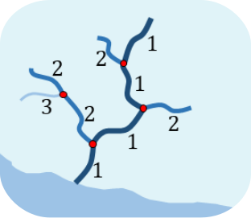
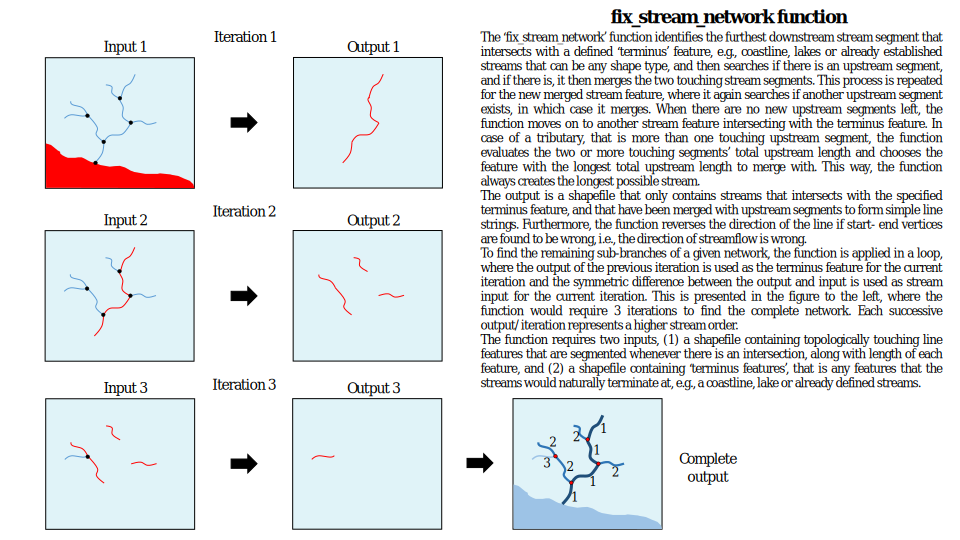
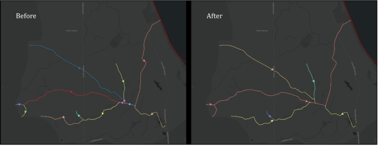

<!-- PROJECT LOGO -->
 

  

  <h3 align="center">WP3-Streams</h3>

  

    A function for assigning stream delineation and flow direction for simple linestrings representing streams.
     
    <a href="https://github.com/mtoernerh"><strong>Explore the contents »</strong></a>
     
     
    <a href="https://github.com/mtoernerh/WP3-Streams/tree/main/example">View Examples</a>
    ·
    <a href="https://github.com/mtoernerh/WP3-Streams/issues">Report Bug</a>
    ·
    <a href="https://github.com/mtoernerh/WP3-Streams/issues">Request Feature</a>
  

<!-- TABLE OF CONTENTS -->

  
Table of Contents

  <ol>
    <li>
      <a href="#introduction">Introduction</a>
      <ul>
        <li><a href="#requirements">Requirements</a></li>
      </ul>
    </li>
    <li>
      <a href="#description">Description</a>
    </li>
    <li><a href="#license">License</a></li>
    <li><a href="#contact">Contact</a></li>
    <li><a href="#acknowledgments">Acknowledgments</a></li>
  </ol>

## Introduction
This is a an old project for including +3000 km streams targeted by the Water Framework Directive (WFD) to the Danish National Water Resources Model (DK-model). The state of the code is chaotic, but a working example for the island of Fyn is included. The objective of the code is to process shapefile linestrings representing streams, but that are lacking proper stream delineation and flow direction, and correcting those two attributes. Furthermore, the function attempts to resolve looping- and self-intersecting streams although proper delination and flow direction is ambigious in those cases.

It is important that the linestring input is topologically connected, that is the function will not be able to detect upstream segments unless they are actually connected. This could perhaps be somewhat circumvented by using a buffer search around the start vertex, and snapping to the potential nearest end vertices of the upstream linestrings.

### Requirements

 

(<a href="#readme-top">back to top</a>)

## Description

Below is a simple example of processing streams represented as simple linestrings, where proper delineation of main- and substreams and flow direction is assigned. Each color represents a unique linestring, and the mid-line arrow shows the direction of flow. You will notice in the before image, that flow direction is random with no apparent pattern, furthermore the lack of stream delineation makes it ambigious as to which linestrings belong to which streams. This if of course one intepretation of that, but it is easily understandable and the method for delineating is systematic and consistent.

(<a href="#readme-top">back to top</a>)

## License

Distributed under the MIT License. See `LICENSE.txt` for more information.

(<a href="#readme-top">back to top</a>)

## Contact

Mark Frenstrup Tørner Hansen - m.toernerhansen@proton.me

Project Link: [https://github.com/mtoernerh/WP3-Streams/](https://github.com/mtoernerh/WP3-Streams/)

(<a href="#readme-top">back to top</a>)

## Acknowledgments

* [Geological Survey of Denmark and Greenland](https://eng.geus.dk/)
* [Agency for Data Supply and Infrastructure](https://eng.sdfi.dk/)
* [Minestry of Environment of Denmark](https://eng.mst.dk/)
* [Water Framework Directive](https://environment.ec.europa.eu/topics/water/water-framework-directive_en)
* [Best-README-Template](https://github.com/othneildrew/Best-README-Template)

(<a href="#readme-top">back to top</a>)

<!-- MARKDOWN LINKS & IMAGES -->
<!-- https://www.markdownguide.org/basic-syntax/#reference-style-links -->

[Example]: https://github.com/mtoernerh/WP3-Streams/images/stream_correction.svg
